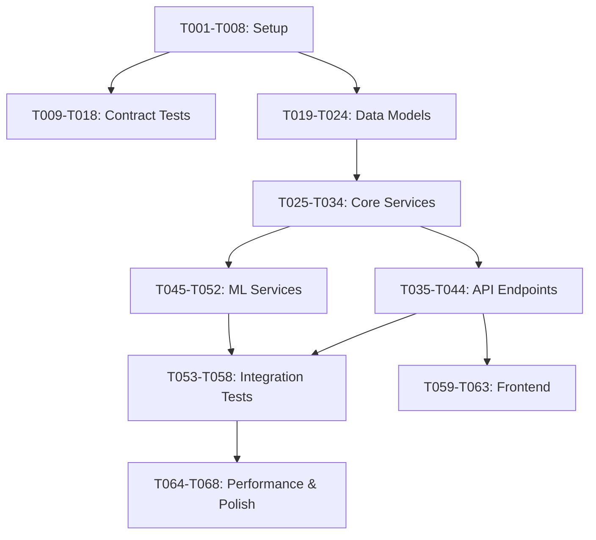

# Implementation Tasks: Personalized Content Recommendation System

**Feature Branch**: `002-core-philosophy-beyond`  
**Created**: 2025-01-18  
**Tech Stack**: Rust (backend), Python (ML), Dioxus (frontend), SurrealDB, Redis, GCP

## Task Overview

Total tasks: 90  
Parallel groups: 15  
Estimated duration: 3-4 weeks  

### Task Categories:
- **Setup & Infrastructure**: T001-T008 (Project initialization)
- **Contract Tests**: T009-T018 (API contract validation) [P]
- **Data Models**: T019-T028 (Entity implementations including experiments) [P]
- **Core Services**: T029-T044 (Business logic + experimentation services)
- **API Endpoints**: T045-T058 (REST API handlers + experiment APIs)
- **ML Services**: T059-T066 (Model training and serving)
- **Integration Tests**: T067-T078 (End-to-end + experiment tests) [P]
- **Frontend**: T079-T085 (UI components + experiment dashboard)
- **Performance & Polish**: T086-T090 (Optimization and docs) [P]

**[P]** = Can be executed in parallel

---

## Phase 1: Setup & Infrastructure

### T001: Initialize Backend Project
**File**: `backend/Cargo.toml`, `backend/src/main.rs`
```bash
cargo new backend --bin
cd backend
cargo add axum tokio serde surrealdb redis
cargo add --dev reqwest tower
```
Create basic Axum server with health endpoint.

### T002: Initialize Frontend Project
**File**: `frontend/Cargo.toml`, `frontend/index.html`
```bash
cargo new frontend
cd frontend
cargo add dioxus dioxus-web reqwest serde
trunk init
```
Set up Dioxus with basic app component.

### T003: Initialize ML Services
**File**: `ml-services/requirements.txt`, `ml-services/setup.py`
```bash
mkdir -p ml-services/{training,serving,tests}
python -m venv ml-services/.venv
pip install torch transformers numpy pandas fastapi uvicorn
```
Create Python package structure for ML components.

### T004: Configure Docker Environment
**File**: `docker-compose.yml`, `.env.example`
```yaml
services:
  surrealdb:
    image: surrealdb/surrealdb:latest
    ports: ["8000:8000"]
  redis:
    image: redis:7-alpine
    ports: ["6379:6379"]
```
Set up local development infrastructure.

### T005: Create Shared Protobuf Definitions
**File**: `proto/recommendation.proto`
```protobuf
message UserProfile {
  string id = 1;
  string username = 2;
  repeated string preferred_genres = 3;
}
```
Define shared data structures for cross-service communication.

### T006: Set Up Database Migrations
**File**: `migrations/001_initial_schema.surql`
```surrealql
DEFINE TABLE user SCHEMAFULL;
DEFINE FIELD email ON user TYPE string ASSERT string::is::email($value);
DEFINE INDEX user_email ON user COLUMNS email UNIQUE;
```
Create initial SurrealDB schema.

### T007: Configure CI/CD Pipeline
**File**: `.github/workflows/ci.yml`
```yaml
name: CI
on: [push, pull_request]
jobs:
  test:
    runs-on: ubuntu-latest
    steps:
      - uses: actions/checkout@v3
      - run: cargo test --all
```
Set up GitHub Actions for automated testing.

### T008: Create Development Scripts
**File**: `scripts/dev.sh`, `scripts/test.sh`
```bash
#!/bin/bash
docker-compose up -d
cargo watch -x run
```
Helper scripts for development workflow.

---

## Phase 2: Contract Tests (TDD) [P]

### T009: Test Homepage Recommendations Endpoint [P]
**File**: `backend/tests/contract/test_homepage_recommendations.rs`
```rust
#[tokio::test]
async fn test_get_homepage_recommendations() {
    let response = client.get("/api/v1/recommendations/home?user_id=123")
        .send().await.unwrap();
    assert_eq!(response.status(), 200);
    // Validate against OpenAPI schema
}
```

### T010: Test Next Recommendations Endpoint [P]
**File**: `backend/tests/contract/test_next_recommendations.rs`
Test POST `/recommendations/next` contract compliance.

### T011: Test Search Recommendations Endpoint [P]
**File**: `backend/tests/contract/test_search_recommendations.rs`
Test POST `/recommendations/search` with filters.

### T012: Test User Profile Endpoints [P]
**File**: `backend/tests/contract/test_user_profile.rs`
Test GET/PUT `/user/profile` operations.

### T013: Test Onboarding Endpoint [P]
**File**: `backend/tests/contract/test_onboarding.rs`
Test POST `/user/onboarding` with validation.

### T014: Test Interaction Tracking Endpoint [P]
**File**: `backend/tests/contract/test_interactions.rs`
Test POST `/interactions/track` event handling.

### T015: Test Batch Interactions Endpoint [P]
**File**: `backend/tests/contract/test_batch_interactions.rs`
Test POST `/interactions/batch` with multiple events.

### T016: Test Content Metadata Endpoint [P]
**File**: `backend/tests/contract/test_content.rs`
Test GET `/content/{id}` with personalization.

### T017: Test Trending Content Endpoint [P]
**File**: `backend/tests/contract/test_trending.rs`
Test GET `/content/trending` with time windows.

### T018: Test Authentication Flow [P]
**File**: `backend/tests/contract/test_auth.rs`
Test JWT authentication across all endpoints.

---

## Phase 3: Data Models [P]

### T019: Implement UserProfile Model [P]
**File**: `backend/src/models/user_profile.rs`
```rust
#[derive(Serialize, Deserialize, Debug)]
pub struct UserProfile {
    pub id: String,
    pub username: String,
    pub email: String,
    pub preferred_audio: AudioPreference,
    pub preference_vector: Vec<f32>,
}
```
Include validation and database mapping.

### T020: Implement ContentItem Model [P]
**File**: `backend/src/models/content_item.rs`
Anime/manga content with enriched metadata and embeddings.

### T021: Implement UserInteraction Model [P]
**File**: `backend/src/models/user_interaction.rs`
Track user engagement events with type-specific data.

### T022: Implement Recommendation Model [P]
**File**: `backend/src/models/recommendation.rs`
Recommendation with scoring and presentation context.

### T023: Implement SessionContext Model [P]
**File**: `backend/src/models/session_context.rs`
Session state with intent predictions.

### T024: Implement CarouselRow Model [P]
**File**: `backend/src/models/carousel_row.rs`
Personalized carousel configuration.

### T025: Implement Experiment Model [P]
**File**: `backend/src/models/experiment.rs`
```rust
#[derive(Serialize, Deserialize, Debug)]
pub struct Experiment {
    pub id: String,
    pub name: String,
    pub status: ExperimentStatus,
    pub variants: Vec<ExperimentVariant>,
    pub primary_metric: String,
}
```
A/B test configuration and variant definitions.

### T026: Implement ExperimentAssignment Model [P]
**File**: `backend/src/models/experiment_assignment.rs`
User-experiment assignment tracking with stable hashing.

### T027: Implement ExperimentMetrics Model [P]
**File**: `backend/src/models/experiment_metrics.rs`
Real-time and aggregated experiment metrics.

### T028: Implement MultiArmedBandit Model [P]
**File**: `backend/src/models/multi_armed_bandit.rs`
MAB configuration for dynamic optimization.

---

## Phase 4: Core Services

### T029: Implement Database Connection Pool
**File**: `backend/src/services/database.rs`
```rust
pub struct Database {
    surreal: Surreal<Ws>,
    redis: redis::Client,
}
```
Connection pooling with retry logic.

### T030: Implement User Service
**File**: `backend/src/services/user_service.rs`
User registration, authentication, profile management.

### T031: Implement Content Service
**File**: `backend/src/services/content_service.rs`
Content retrieval, metadata enrichment, search.

### T032: Implement Interaction Service
**File**: `backend/src/services/interaction_service.rs`
Event tracking, aggregation, real-time processing.

### T033: Implement Recommendation Engine Library
**File**: `backend/src/lib/recommendation_engine/mod.rs`
```rust
pub trait RecommendationStrategy {
    async fn recommend(&self, user_id: &str, limit: usize) -> Vec<Recommendation>;
}
```
Core recommendation logic with multiple strategies.

### T034: Implement Content-Based Filtering
**File**: `backend/src/lib/recommendation_engine/content_based.rs`
Similarity calculation using content vectors.

### T035: Implement Collaborative Filtering
**File**: `backend/src/lib/recommendation_engine/collaborative.rs`
User-based and item-based collaborative filtering.

### T036: Implement Hybrid Recommender
**File**: `backend/src/lib/recommendation_engine/hybrid.rs`
Combine multiple recommendation strategies.

### T037: Implement Cache Service
**File**: `backend/src/services/cache_service.rs`
Redis caching for embeddings and recommendations.

### T038: Implement Feature Store Client
**File**: `backend/src/services/feature_store.rs`
Interface to ML feature store for real-time features.

### T039: Implement Experiment Service
**File**: `backend/src/services/experiment_service.rs`
```rust
pub struct ExperimentService {
    pub async fn assign_user(&self, user_id: &str) -> Vec<ExperimentAssignment>;
    pub async fn get_variant_config(&self, assignment: &ExperimentAssignment) -> VariantConfig;
}
```
Experiment assignment and variant configuration.

### T040: Implement Carousel Concept Selector
**File**: `backend/src/services/carousel_concept_selector.rs`
```rust
pub trait ConceptSelector {
    async fn select_concepts(&self, user: &UserProfile, config: &VariantConfig) -> Vec<CarouselConcept>;
}
```
Determines which carousel concepts to show based on user profile and experiment config.

### T041: Implement Carousel Ranking Service
**File**: `backend/src/services/carousel_ranking_service.rs`
```rust
pub struct CarouselRanker {
    pub async fn rank_carousels(&self, carousels: Vec<CarouselRow>, config: &VariantConfig) -> Vec<CarouselRow>;
}
```
Ranks and orders carousels based on experiment configuration.

### T042: Implement Multi-Armed Bandit Service
**File**: `backend/src/services/mab_service.rs`
```rust
impl MultiArmedBanditService {
    pub async fn select_arm(&self, mab_id: &str) -> BanditArm;
    pub async fn update_reward(&self, mab_id: &str, arm_id: &str, reward: f32);
}
```
Dynamic optimization for carousel ordering and feature selection.

### T043: Implement Metrics Aggregation Service
**File**: `backend/src/services/metrics_aggregation.rs`
Real-time calculation of experiment metrics and statistical significance.

### T044: Implement Title Generation Service
**File**: `backend/src/services/title_generation.rs`
```rust
pub enum TitleGenerator {
    Static(String),
    Template(TitleTemplate),
    LLM(LLMGenerator),
}
```
Dynamic carousel title generation based on variant config.

---

## Phase 5: API Endpoints

### T045: Implement Homepage Recommendations Handler
**File**: `backend/src/api/recommendations.rs`
```rust
pub async fn get_homepage_recommendations(
    Query(params): Query<HomeParams>,
    State(state): State<AppState>,
) -> Result<Json<CarouselResponse>> {
    // Generate personalized carousels
}
```

### T046: Implement Next Recommendations Handler
**File**: `backend/src/api/recommendations.rs`
Post-episode recommendation generation.

### T047: Implement Search Recommendations Handler
**File**: `backend/src/api/search.rs`
Personalized search with filtering.

### T048: Implement User Profile Handlers
**File**: `backend/src/api/user.rs`
GET/PUT profile operations.

### T049: Implement Onboarding Handler
**File**: `backend/src/api/onboarding.rs`
New user survey processing.

### T050: Implement Interaction Tracking Handler
**File**: `backend/src/api/interactions.rs`
Single event tracking endpoint.

### T051: Implement Batch Interaction Handler
**File**: `backend/src/api/interactions.rs`
Bulk event ingestion.

### T052: Implement Content Metadata Handler
**File**: `backend/src/api/content.rs`
Content retrieval with optional personalization.

### T053: Implement Trending Content Handler
**File**: `backend/src/api/trending.rs`
Time-windowed trending calculation.

### T054: Implement Health Check Endpoints
**File**: `backend/src/api/health.rs`
System and component health monitoring.

### T055: Implement Experiment Management API
**File**: `backend/src/api/experiments.rs`
```rust
pub async fn create_experiment(Json(experiment): Json<Experiment>) -> Result<Json<ExperimentResponse>>;
pub async fn get_experiment_status(Path(id): Path<String>) -> Result<Json<Experiment>>;
pub async fn update_experiment(Path(id): Path<String>, Json(update): Json<ExperimentUpdate>) -> Result<()>;
```
CRUD operations for experiments.

### T056: Implement Experiment Assignment API
**File**: `backend/src/api/experiment_assignment.rs`
```rust
pub async fn get_user_assignments(Query(params): Query<AssignmentParams>) -> Result<Json<Vec<ExperimentAssignment>>>;
```
User experiment assignment endpoint.

### T057: Implement Experiment Metrics API
**File**: `backend/src/api/experiment_metrics.rs`
```rust
pub async fn get_experiment_metrics(Path(exp_id): Path<String>) -> Result<Json<ExperimentMetrics>>;
pub async fn get_variant_comparison(Path(exp_id): Path<String>) -> Result<Json<VariantComparison>>;
```
Real-time experiment metrics and analysis.

### T058: Implement MAB Control API
**File**: `backend/src/api/mab_control.rs`
Endpoints for MAB configuration and monitoring.

---

## Phase 6: ML Services

### T059: Implement Foundation Model Training Pipeline
**File**: `ml-services/training/foundation_model/train.py`
```python
class RecommendationTransformer(nn.Module):
    def __init__(self, config):
        self.encoder = TransformerEncoder(config)
        self.decoder = nn.Linear(config.hidden_size, config.vocab_size)
```
Transformer architecture for unified recommendations.

### T060: Implement Intent Predictor
**File**: `ml-services/training/intent_predictor/model.py`
Hierarchical multi-task learning for session intent.

### T061: Implement Content Enricher
**File**: `ml-services/training/content_enricher/multimodal.py`
Process artwork, text, audio for content understanding.

### T062: Implement User Profiler
**File**: `ml-services/training/user_profiler/embeddings.py`
Generate and update user preference vectors.

### T063: Implement Model Server
**File**: `ml-services/serving/model_server/app.py`
```python
@app.post("/predict")
async def predict(request: PredictionRequest):
    embeddings = model.encode(request.items)
    return {"embeddings": embeddings.tolist()}
```
FastAPI server for model inference.

### T064: Implement Feature Pipeline
**File**: `ml-services/serving/feature_store/pipeline.py`
Real-time feature computation and caching.

### T065: Implement Training Data Loader
**File**: `ml-services/training/data_pipeline/loader.py`
Efficient data loading for model training.

### T066: Implement Model Evaluation Suite
**File**: `ml-services/tests/test_model_performance.py`
Metrics calculation and A/B test analysis.

---

## Phase 7: Integration Tests [P]

### T067: Test New User Onboarding Journey [P]
**File**: `backend/tests/integration/test_onboarding_flow.rs`
Complete flow from registration to first recommendations.

### T068: Test Watch History Impact [P]
**File**: `backend/tests/integration/test_watch_history.rs`
Verify recommendations improve with viewing data.

### T069: Test Content Discovery Flow [P]
**File**: `backend/tests/integration/test_discovery.rs`
Search, browse, and recommendation diversity.

### T070: Test Session Intent Detection [P]
**File**: `backend/tests/integration/test_intent_detection.rs`
Verify browsing vs binge-watching detection.

### T071: Test Cold Start Handling [P]
**File**: `backend/tests/integration/test_cold_start.rs`
New user with no data receives valid recommendations.

### T072: Test Performance Under Load [P]
**File**: `backend/tests/integration/test_load.rs`
Concurrent user simulation and latency verification.

### T073: Test Experiment Assignment Flow [P]
**File**: `backend/tests/integration/test_experiment_assignment.rs`
Verify stable user assignment to experiment variants.

### T074: Test Carousel Concept Selection [P]
**File**: `backend/tests/integration/test_carousel_concepts.rs`
```rust
#[tokio::test]
async fn test_concept_selection_by_variant() {
    // Test different carousel concepts appear based on variant config
}
```
Verify carousel concepts change based on experiment variant.

### T075: Test Carousel Ranking Variations [P]
**File**: `backend/tests/integration/test_carousel_ranking.rs`
Test different carousel ordering algorithms and weights.

### T076: Test Title Generation Modes [P]
**File**: `backend/tests/integration/test_title_generation.rs`
Verify static, template, and LLM-generated titles.

### T077: Test MAB Carousel Optimization [P]
**File**: `backend/tests/integration/test_mab_optimization.rs`
Verify multi-armed bandit converges to optimal carousel order.

### T078: Test Experiment Metrics Collection [P]
**File**: `backend/tests/integration/test_metrics_collection.rs`
Ensure all experiment metrics are accurately tracked.

---

## Phase 8: Frontend Components

### T079: Implement Homepage Component
**File**: `frontend/src/pages/home.rs`
```rust
#[component]
fn HomePage(cx: Scope) -> Element {
    let carousels = use_future(cx, (), |_| fetch_carousels());
    // Render personalized carousels
}
```

### T080: Implement Carousel Component
**File**: `frontend/src/components/carousel.rs`
Dynamic carousel with multiple display modes.

### T081: Implement Content Card Component
**File**: `frontend/src/components/content_card.rs`
Anime/manga display with artwork variants.

### T082: Implement Onboarding Flow
**File**: `frontend/src/pages/onboarding.rs`
Multi-step survey for new users.

### T083: Implement Search Interface
**File**: `frontend/src/pages/search.rs`
Search with filters and personalized results.

### T084: Implement Experiment Dashboard
**File**: `frontend/src/pages/admin/experiments.rs`
```rust
#[component]
fn ExperimentDashboard(cx: Scope) -> Element {
    // Display experiment status, metrics, and controls
}
```
Admin interface for experiment management.

### T085: Implement Metrics Visualization
**File**: `frontend/src/components/metrics_chart.rs`
Real-time charts for experiment metrics and statistical significance.

---

## Phase 9: Performance & Polish [P]

### T086: Implement Response Caching [P]
**File**: `backend/src/middleware/cache.rs`
Cache recommendations with user-specific TTL.

### T087: Add OpenTelemetry Instrumentation [P]
**File**: `backend/src/middleware/tracing.rs`
Distributed tracing and metrics collection.

### T088: Create Load Testing Suite [P]
**File**: `tests/load/k6_scenarios.js`
K6 scripts for performance validation.

### T089: Write API Documentation [P]
**File**: `docs/api_guide.md`
Developer guide with examples.

### T090: Create Deployment Scripts [P]
**File**: `deploy/terraform/main.tf`, `deploy/k8s/deployment.yaml`
Infrastructure as code for GCP deployment.

---

## Experimentation Capabilities

### Supported Experiment Types

1. **Carousel Concept Selection**
   - Which carousel types to show (FOR_YOU, TRENDING_NOW, MOOD_BASED, etc.)
   - Dynamic selection based on user profile and time of day
   - A/B test different concept combinations

2. **Carousel Ranking**
   - Test different ordering algorithms (engagement-based, MAB-optimized, fresh-first)
   - Experiment with ranking weights and features
   - Personalized vs global ranking strategies

3. **Title Generation**
   - Static titles: "Popular Action Anime"
   - Template-based: "Because You Loved {show}"
   - LLM-generated: Dynamic contextual titles
   - Emotional appeals vs descriptive titles

4. **Content Selection**
   - Pure collaborative vs content-based vs hybrid
   - Diversity injection rates (10% vs 16.7% vs 25%)
   - Different similarity metrics and algorithms

5. **Visual Presentation**
   - Carousel types (large tiles, compact lists, mixed)
   - Artwork selection strategies (action shots vs character art)
   - Animation styles and transitions

6. **Behavioral Modifications**
   - Prefetching strategies
   - Autoplay settings
   - Hover behaviors and previews

### Example Experiment Configuration

```typescript
{
  id: "exp_001_carousel_concepts",
  name: "Carousel Concept Optimization Q1 2025",
  status: "RUNNING",
  target_percentage: 20,  // 20% of users
  variants: [
    {
      name: "control",
      allocation_percentage: 50,
      config: {
        carousel_concepts: ["FOR_YOU", "TRENDING_NOW", "CONTINUE_WATCHING"],
        title_generation_mode: "static"
      }
    },
    {
      name: "personalized_concepts",
      allocation_percentage: 25,
      config: {
        carousel_concepts: ["MOOD_BASED", "TIME_BASED", "BECAUSE_YOU_WATCHED"],
        concept_selection_strategy: "user_profile_based",
        title_generation_mode: "template"
      }
    },
    {
      name: "llm_optimized",
      allocation_percentage: 25,
      config: {
        concept_selection_strategy: "llm_driven",
        title_generation_mode: "llm",
        carousel_ranking_algorithm: "mab_optimized"
      }
    }
  ],
  primary_metric: "ctr",
  secondary_metrics: ["session_duration", "discovery_rate", "return_rate_24h"]
}
```

---

## Execution Examples

### Parallel Execution Group 1 (Contract Tests)
```bash
# Run all contract tests in parallel
Task agent --parallel \
  "T009: Test homepage recommendations endpoint" \
  "T010: Test next recommendations endpoint" \
  "T011: Test search recommendations endpoint" \
  "T012: Test user profile endpoints" \
  "T013: Test onboarding endpoint"
```

### Parallel Execution Group 2 (Data Models)
```bash
# Create all models simultaneously
Task agent --parallel \
  "T019: Implement UserProfile model" \
  "T020: Implement ContentItem model" \
  "T021: Implement UserInteraction model" \
  "T022: Implement Recommendation model"
```

### Sequential Execution (Core Services)
```bash
# Services depend on each other
Task agent "T025: Implement database connection pool"
Task agent "T026: Implement user service"
Task agent "T027: Implement content service"
```

---

## Task Dependencies



---

## Success Criteria

- [ ] All contract tests pass (T009-T018)
- [ ] Integration tests pass (T067-T078)
- [ ] Recommendation latency < 500ms (T072)
- [ ] 16.7% diversity in recommendations (T069)
- [ ] Onboarding to first recommendation < 2s (T067)
- [ ] All endpoints return valid OpenAPI responses
- [ ] Frontend displays personalized carousels
- [ ] ML model achieves >0.7 AUC on intent prediction
- [ ] Experiment assignment is deterministic and stable (T073)
- [ ] Carousel concepts vary by experiment variant (T074)
- [ ] MAB converges to optimal carousel order within 100 iterations (T077)
- [ ] Experiment metrics show statistical significance at p<0.05 (T078)
- [ ] Admin dashboard displays real-time experiment metrics (T084)

---

## Notes

1. **Parallel Execution**: Tasks marked [P] can run simultaneously as they work on different files
2. **TDD Enforcement**: Contract tests (T009-T018) must be written and failing before implementing endpoints
3. **Real Dependencies**: Use actual SurrealDB and Redis instances, not mocks
4. **Library Structure**: Each major component (recommendation-engine, intent-predictor) is a separate library with CLI
5. **Incremental Commits**: Each task should be a separate commit showing test → implementation cycle

---

*Generated from design documents in `/specs/002-core-philosophy-beyond/`*